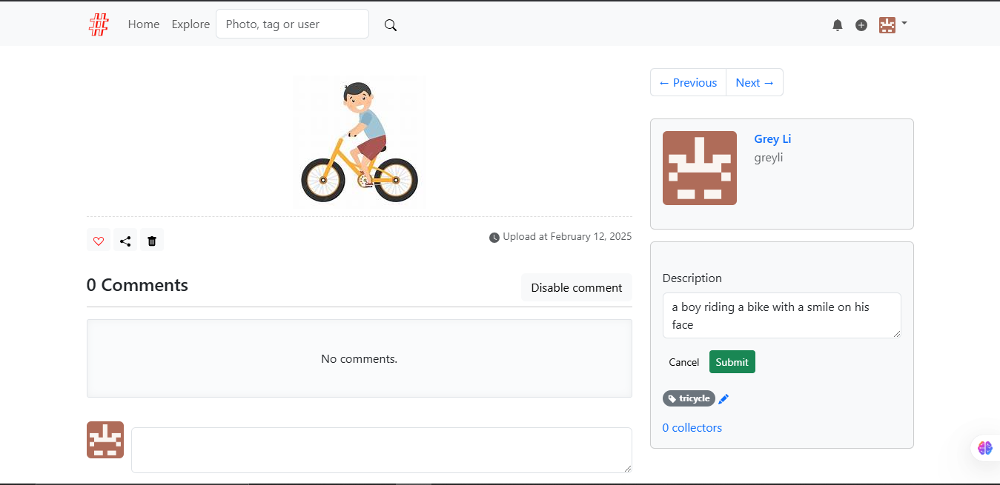

# Moments

A photo sharing social networking app built with Python and Flask. The example application for the book _[Python Web Development with Flask (2nd edition)](https://helloflask.com/en/book/4)_ (《[Flask Web 开发实战（第 2 版）](https://helloflask.com/book/4)》).

Demo: http://moments.helloflask.com


## Installation

Clone the repo:

```
$ git clone https://github.com/greyli/moments
$ cd moments
```

Install dependencies with [PDM](https://pdm.fming.dev):

```
$ pdm install
```

> [!TIP]
> If you don't have PDM installed, you can create a virtual environment with `venv` and install dependencies with `pip install -r requirements.txt`.

## Image Captioning using BLIP Model (moments\moments\ml\image_caption.py)

This script uses the BLIP (Bootstrapping Language-Image Pretraining) model to generate captions for images. It employs PyTorch for processing and the lavis library for loading the pre-trained model and image preprocessing. The model is capable of generating descriptive captions for input images.

`Requirements`:

1. Python 3.x
2. PyTorch
3. lavis library (for loading the model and image processors)
4. Pillow library for image handling
5. GPU (optional but recommended for better performance)
6. opencv2

> [!TIP]
> If you encounter the following error:

`RuntimeError: module compiled against ABI version 0x1000009 but this version of numpy is 0x2000000`

SOLUTION:

```
pip install numpy==1.21.0
pip uninstall opencv-python
pip install opencv-python
pip cache purge
pip install numpy torch lavis
```

Make sure all other dependencies are compatible with the current version of NumPy. You can use the following command to list installed packages and their versions:

```
$ pip list
```

`Installation`

1. Install PyTorch:

```
$ pip install torch
```

2. Install lavis library:

```
$ pip install lavis
```

> [!OR]
> Clone the repo: `$ git clone https://github.com/salesforce/LAVIS.git`.
> Change directory : `cd lavis`
> pip install `requirements.txt`.
> Install the package with `pip install -e .`

> [!TIP]
> any open3d error: `pip install open3d==0.19.0`
> then reinstall: `pip install salesforce-lavis`

3. Install Pillow for image handling:

```
$ pip install pillow (version >9)
```

## How to use

1. Load the required model and image processing tools using:
   model, vis_processors = load_caption_tools(name='blip_caption', model_type='base_coco')

2. Pass the model and pre-processed image to generate a caption:
   caption = caption_image(model, vis_processors, 'path_to_image.jpg')
   print("Generated Caption:", caption)

`Functions`
load_caption_tools(name, model_type): Loads the BLIP caption model and corresponding image processors. Default parameters use the BLIP model trained on COCO dataset.

caption_image(model, vis_processors, image_path): Takes the loaded model and the pre-processing tools to generate a caption for the image located at image_path.

## Azure Object Detection (moments\moments\ml\object_detection.py)

This script integrates with Azure's Computer Vision API to perform object detection on an input image. It loads environment variables from a .env file, containing your Azure API key and endpoint, and sends a request to Azure’s Object Detection API to identify objects in the image.

`Requirements`

1. Python 3.x
2. Azure Computer Vision API key and endpoint
3. requests library for API calls
4. python-dotenv library for managing environment variables

## Connecting to the Azure Vision API

1. Sign up for the a student account for Microsoft Azure: https://azure.microsoft.com/en-us/free/students/ – no credit card required

2. Create an instance of the Computer Vision service and get an API endpoint of your instance of the service.

3. Get a subscription key to authorize your script to call the Computer Vision API.

4. Update the code with the endpoint and key and test it.

Installation

1. Install the required libraries:

```
$ pip install requests python-dotenv
```

2. Create a .env file in the working directory (if it doesn't already exist) with the following content:
   AZURE_KEY=your_azure_api_key
   AZURE_ENDPOINT=your_azure_api_endpoint

## How to Use

1. Ensure that your .env file contains your Azure subscription key and endpoint.
2. Use the query function to perform object detection:
   objects = query('path_to_image.jpg')
   print("Detected Objects:", objects)

## Functions

load_api_key(): Loads the API key and endpoint from the .env file and checks that they are correctly set.
query(filename): Sends the image located at filename to Azure’s Object Detection API and returns a list of detected objects.

## To initialize the app, run the `flask init-app` command:

```
$ pdm run flask init-app
```

If you just want to try it out, generate fake data with `flask lorem` command then run the app:

```
$ pdm run flask lorem
```

It will create a test account:

-   email: `admin@helloflask.com`
-   password: `moments`

Now you can run the app:

```
$ pdm run flask run
* Running on http://127.0.0.1:5000/
```

## Output:

Upon successfully uploading an image, both the image captioning and object detection models run on the uploaded image.

Initially, there is no description displayed.
When the Edit Description button is clicked, the automatically generated caption from the image captioning model appears in the description field.
Additionally, relevant tags are generated based on the object detection results, which are shown after the image is successfully uploaded.

## License

This project is licensed under the MIT License (see the
[LICENSE](LICENSE) file for details).
